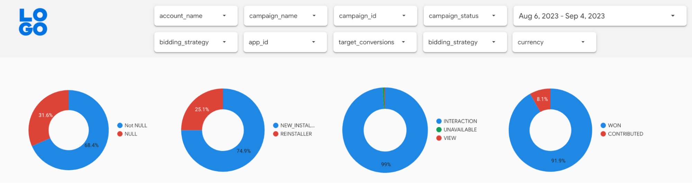
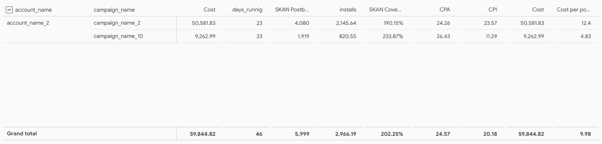
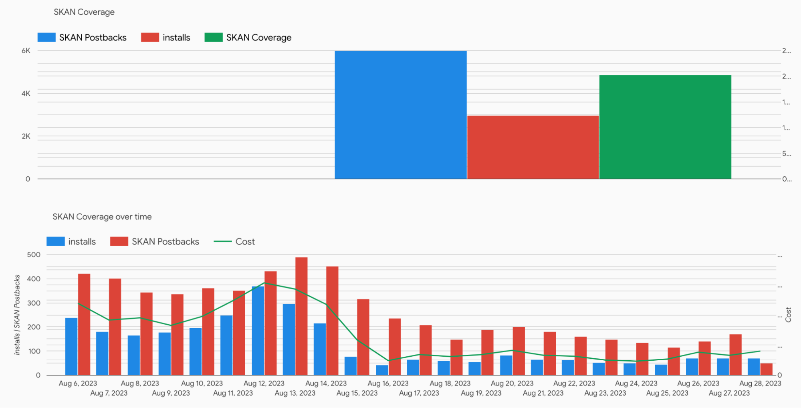
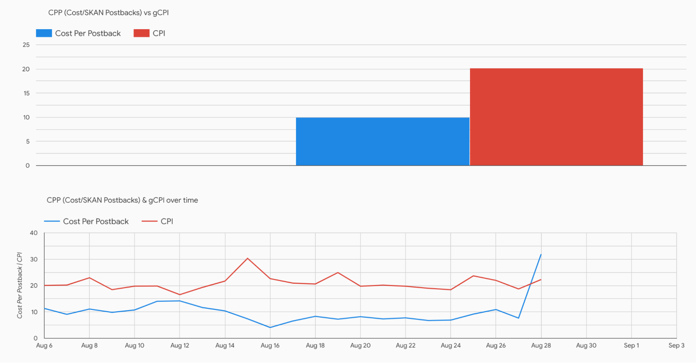
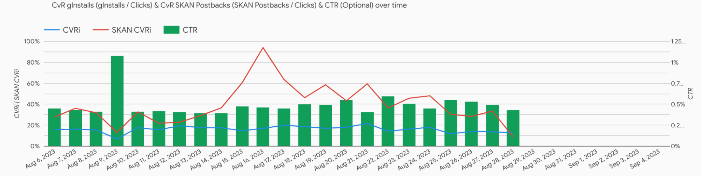
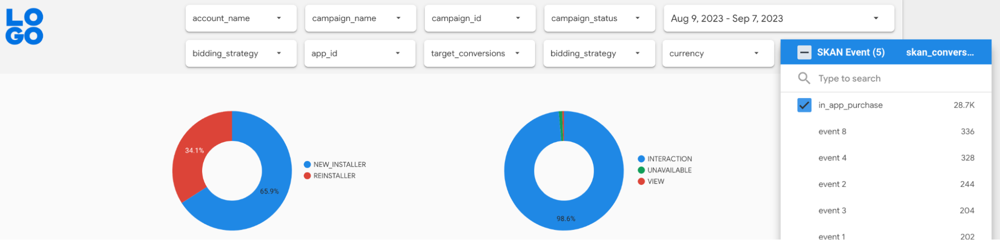
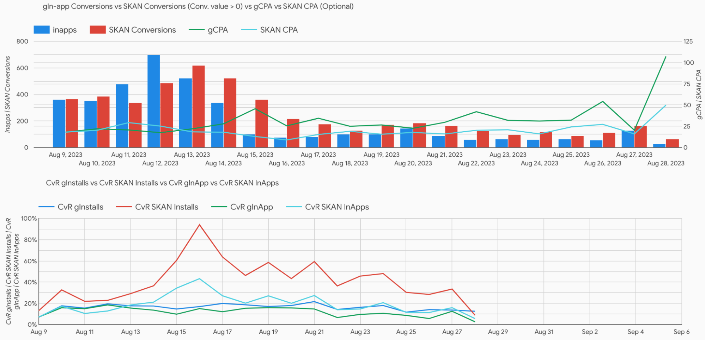
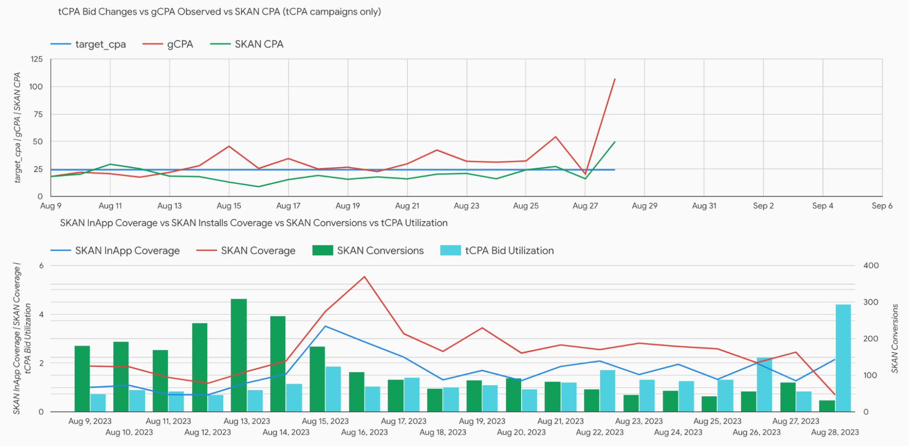
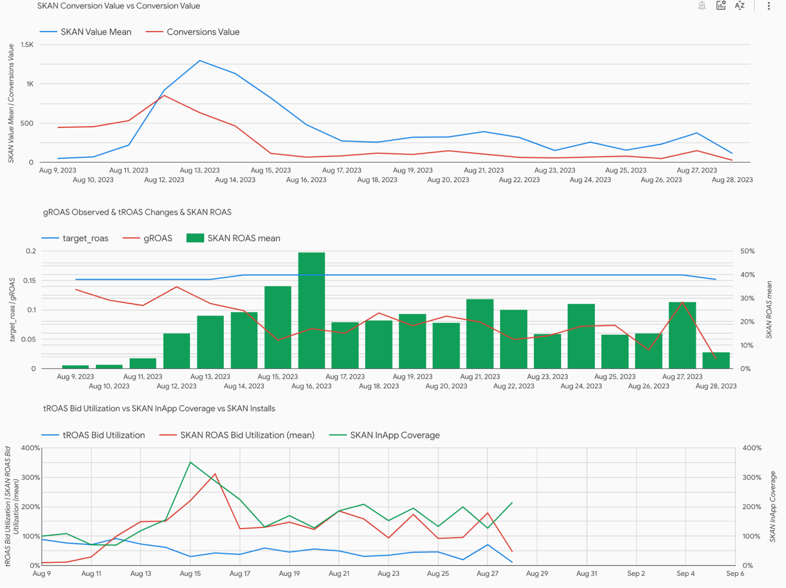

# SKAN Reports in App Reporting Pack

App Reporting Pack (ARP) now includes iOS SKAN Reporting which is a "one-stop-shop" solution for iOS performance reporting that integrates & combines clients Google Ads App Campaign & SKAN data. ARP offers 2 SKAN report types:

* **SKAN postbacks reports**: total SKAN postbacks per campaign vs Google Ads installs, SKAN CPI vs. Google Ads CPI, postbacks breakdown by interaction type, NULL/Not NULL conversion value, won/contributed, etc.
* **Custom SKAN conversion reports** which require external SKAN schema: number of selected SKAN conversions per campaigns vs. Google Ads biddable conversions, SKAN conversion value vs. Google Ads conversion value, SKAN ROAS vs. Google Ads ROAS, etc.

## Deployment
SKAN postbacks reports are available by default. ARP fetches the SKAN data from the Google Ads API and the dashboard provides visualization for the most important reports. In order to activate SKAN conversion reports it’s necessary to provide a SKAN schema, so that ARP would be able to map SKAN conversion values to conversion names, revenue ranges and event count. The easiest way to provide the SKAN schema is to do it while deploying the ARP.

During the deployment the wizard will ask you to provide a fully qualified SKAN schema table name. In the example below the table name is `arp.skan_schema`. It can be located in any dataset in the current GCP project.


> When adding schema to an existing `app_reporting_pack.yaml` add the following fields
> * under `gaarf-bq > params > macro` add `skan_schema_input_table: PROJECT.DATASET.TABLE_NAME`
> * under `gaarf-bq > params > template` add `has_skan: 'true'`
> * under `scripts > skan_mode > template` add `skan_mode: table` (if `skan_mode` is set to `placeholders` replace `placeholders` with `table`)

The SKAN table schema is expected to have the following fields:
```
app_id: STRING
skan_mapped_event: STRING
skan_conversion_value: INTEGER
skan_event_count: INTEGER
skan_event_value_low: FLOAT
skan_event_value_high: FLOAT
skan_event_value_mean: FLOAT
```

The table schema is similar to the format used by trackers like AppsFlyer, Adjust and others. For example, skan_event_value_low and skan_event_value_high match AppsFlyer’s min_revenue and max_revenue columns from the CSV SKAN schema; skan_event_value_mean is mean value of min and max revenue; skan_event_count is the same as event_counter column.

You can create a SKAN schema table in BQ and copy the data manually, but the most convenient way is to create an external BQ table linked to Google Spreadsheet document with the schema. Then it will be much easier to keep the schema up to date as the BQ table will be automatically updated when you make changes in the Google Sheet. To do so create a Google spreadsheet with the required columns and share the spreadsheet with a service account which has access to BQ (e.g. with Compute Engine default service account). After that create a table as shown below.


## Reports Overview

### SKAN Postbacks sheet

1. Postback breakdowns and filters. The donut charts are interactive, click on an area to apply filters to the whole sheet.



2. SKAN Installs (postbacks), Google Ads installs and other metrics per campaign



3. SKAN Coverage charts. SKAN coverage = SKAN Installs/GAds Installs



4. SKAN CPI (Cost per Postback) vs Google Ad CPI



5. SKAN Conversion Rate (SKAN Postbacks/clicks) vs Google Ads Conversion Rate & CTR




### SKAN In-app sheet (postbacks with CV > 0)

1. Postback breakdowns and filters. There is an additional SKAN Event dropdown filter where you can select custom events you want to filter on. The donut charts are interactive, click on an area to apply filters to the whole sheet.



> **IMPORTANT**: it’s necessary to manually select biddable SKAN conversions in the filter for the charts on this sheet to make sense.

2. Generic in-app conversions metrics. Count of selected SKAN conversions vs biddable GAds conversions, CPA for the selected SKAN conversions vs GAds CPA, SKAN conversion rate (SKAN conversions/Clicks) vs GAds conversion rate.



3. tCPA campaigns metrics. Target CPA vs Google Ads actual CPA vs SKAN CPA over time. SKAN InApp Coverage (SKAN conversions/GAds biddable conversions), SKAN Install Coverage (SKAN Installs/GAds Installs), SKAN Conversions and tCPA Bid Utilization (Actual GAds CPA/Target CPA).



4. tROAS campaigns metrics. SKAN Conversion values vs GAds conversion value. By default it shows SKAN Value Mean, but you can also show Low and High from the optional metrics. Google Ads ROAS vs SKAN ROAS vs Target ROAS. By default SKAN ROAS is calculated using SKAN Value Mean, but you can also show Low and High from the optional metrics. tROAS and SKAN Bid Utilization (actual GAds and SKAN ROAS/Target ROAS) and In-app SKAN Coverage (SKAN InApps/GAds biddable in-apps).




